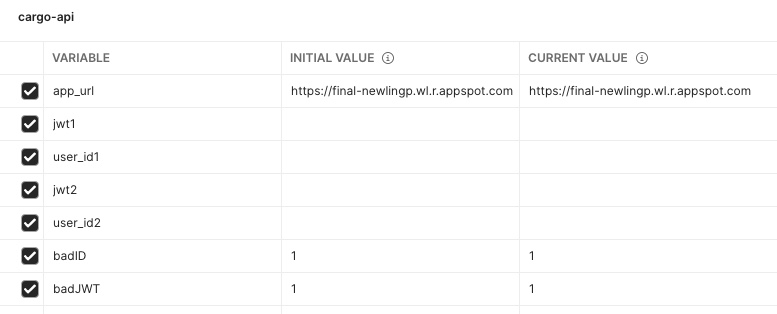

# **Cargo API**

## **Documentation**
The system is fully documented in PDF format [here](documentation/Cargo-API-Full-Docs.pdf). This 44 page documentation comprehensively covers all available endpoints, the access conditions for each endpoint, and the data model for the application.

## **About The Project**
The Cargo Management API system is built using Node.js and Express. The application is deployed on the Google Clout Platform. Data storage is handled but Google Datastore's NoSQL database. For testing of this application a test suite of 177 tests (across 90 request) was created in Postman leveraging the Chai Assertion Library.

## **Using the Application**
Navigate to [https://final-newlingp.wl.r.appspot.com/](https://final-newlingp.wl.r.appspot.com/) in any modern browser. 


From there you will be prompted to authenticate with your Google account (if you do not have one you can create one at this step). The application only accesses your full name as well as your subscriber ID (which we will refer to as userID). These will be saved in the datastore and used in conjunction with JWTs to determine access to manipulation of cargo and boat entities.


Once authenticated you will be presented with the Authenticated screen. This screen will display your full name, your userID as well as a new JWT. This JWT can then be used to access the project's API endpoints by using the JWT as the 'Bearer Token' in the 'Authorization' header of any request made to a protected endpoint.


When making requests to the endpoints the `Accept` and `Content-Type` values of the HTTP request header must be set to `application/json`.
When making requests to endpoints that are protected the `Authorization` header should include `Bearer JWT`, where JWT is a valid JWT created from the application.

## **Endpoints - Summary**
Below are a shortened summary of all of the endpoints of this application. For full documentation please refer to the [full application documentation](documentation/Cargo-API-Full-Docs.pdf).
There are three endpoints to the application. Two are for interaction of, and between Boats and Cargo. The third is for users, but provides limited support.

### Boats
| Method | Endpoint    | Summary                       | Protected |
| ------ | ----------- | ----------------------------- | --------- |
| GET    | /boats      | Get all boats                 | Yes       |
| GET    | /boats/:bid | Get a boat                    | Yes       |
| POST   | /boats      | Create a boat                 | Yes       |
| PATCH  | /boats/:bid | Change some details of a boat | Yes       |
| PUT    | /boats/:bid | Change ALL details of a boat  | Yes       |
| DELETE | /boats/:bid | Delete a boat                 | Yes       |
#### Parameters
Below `:bid` refers to the boat ID of the specific boat.
#### Sample Request Body
```
{
"name": "Evergiven",
"type": "Cargo Freighter",
"length": 12000
}
```
#### Sample Response Body
```
{
“id”: “5632499082330112”,
"name": "Evergiven",
"type": "Cargo Freighter",
"length": 12000,
“self”: "https://final-newlingp.wl.r.appspot.com/boats/5632499082330112”
}
```

### Cargo
| Method | Endpoint    | Summary                                        | Protected |
| ------ | ----------- | ---------------------------------------------- | --------- |
| GET    | /cargo      | Get all cargo                                  | Yes       |
| GET    | /cargo/:cid | Get a specific cargo                           | Yes       |
| POST   | /cargo      | Create cargo                                   | Yes       |
| PATCH  | /cargo/:cid | Change some details of a specific cargo entity | Yes       |
| PUT    | /cargo/:cid | Change ALL details of a specific cargo entity  | Yes       |
| DELETE | /cargo/:cid | Delete a specific cargo entity                 | Yes       |
#### Parameters
Below `:cid` refers to the boat ID of a specific cargo.
#### Sample Request Body
```
{
"volume": 1400,
"content": "Ford Mustangs",
"creationDate": "2021-04-21"
}
```
#### Sample Response Body
```
{
"id": "6468260526555136",
"volume": 1400,
"carrier": null,
"content": "Ford Mustangs",
"creationDate": "2021-04-21",
“self”: "https://final-newlingp.wl.r.appspot.com/cargo/5632499082330112”
}
```
Note: at this time creation data needs to be submitted and does not auto-populate


## Postman Testing
A testing suite has been created with 177 tests utilizing [Postman](https://www.postman.com/). To use these tests you will need to [install Postman](https://www.postman.com/downloads/) and then import the [cargo-api-tests](documentation/PostmanTests/cargo-api-tests.postman_collection.json) and [cargo-api environment](documentation/PostmanTests/cargo-api.postman_environment.json).
Once these have been imported you will need to copy in **two** JWTs as well as corresponding userIDs from **two different** google accounts into the imported environment before the tests can all be run.



After this has been completed you will be run the full battery of tests provided.
